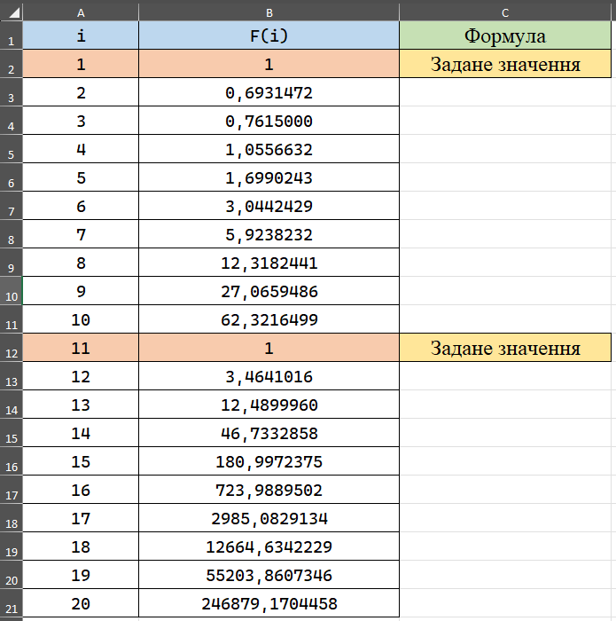

<p align="center"><b>МОНУ НТУУ КПІ ім. Ігоря Сікорського ФПМ СПіСКС</b></p>
<p align="center">
<b>Звіт з Розрахунково-графічної роботи</b><br/>
дисципліни "Вступ до функціонального програмування"
</p>
<p align="right"><b>Студент</b>: Булавчук Данило, КВ-23</p>
<p align="right"><b>Рік</b>: 2025</p>

## Загальне завдання
Реалізувати програму для обчислення функції згідно варіанту мовою Common Lisp. Виконати тестування та порівняти результати.

## Постановка задачі (Варіант 3)

Необхідно обчислити послідовність $F_i$ для $i$ від 1 до 20.
Послідовність визначається наступними формулами:

1.  **Задані значення:**
    * $F_{1} = 1$
    * $F_{11} = 1$
2.  **Формули обчислення:**
    * $F_{i} = F_{i-1} \cdot \ln(i)$, для $i = 2...10$
    * $F_{i} = F_{i-1} \cdot \sqrt{i}$, для $i = 12...20$

## Реалізація програми мовою Common Lisp

Для обчислення використовуються дві рекурсивні допоміжні функції, які обчислюють кожну частину послідовності незалежно. Головна функція `calculate-f-sequence` об'єднує результати.

```lisp
(defun calculate-sequence-part1 (i i-max f-prev)
  "Рекурсивно обчислює послідовність F(i) = F(i-1) * ln(i)"
  (if (> i i-max)
      nil
      (let ((f-current (* f-prev (log i))))
        (cons f-current (calculate-sequence-part1 (1+ i) i-max f-current)))))

(defun calculate-sequence-part2 (i i-max f-prev)
  "Рекурсивно обчислює послідовність F(i) = F(i-1) * sqrt(i)"
  (if (> i i-max)
      nil
      (let ((f-current (* f-prev (sqrt i))))
        (cons f-current (calculate-sequence-part2 (1+ i) i-max f-current)))))

(defun calculate-f-sequence ()
  "Головна функція"
  (let ((f1 1.0)
        (f11 1.0))
    (append
     ;; F1...F10
     (cons f1 (calculate-sequence-part1 2 10 f1))
     ;; F11...F20
     (cons f11 (calculate-sequence-part2 12 20 f11)))))

```
## Реалізація тестових утиліт
Для тестування використовується допоміжна функція `check-float-equal` для коректного порівняння чисел з плаваючою комою з заданою точністю.
```lisp

(defun check-float-equal (val1 val2)
  "Допоміжна функція"
  (let ((tolerance 0.0001))
    (< (abs (- val1 val2)) tolerance)))

(defun run-rgr-tests ()
  "Запуск тестів"
  (let ((results (calculate-f-sequence)))
    
    (format t "--- Тестування ---~%")
    
    ;; Перевірка F1
    (format t "Тест F1 = 1.0: ~:[FAILED~;passed~]~%"
            (check-float-equal (nth 0 results) 1.0))
            
    ;; Перевірка F2 = F1 * ln(2)
    (format t "Тест F2 = ln(2): ~:[FAILED~;passed~]~%"
            (check-float-equal (nth 1 results) (log 2.0)))
            
    ;; Перевірка F3 = F2 * ln(3) = ln(2)*ln(3)
    (format t "Тест F3 = ln(2)*ln(3): ~:[FAILED~;passed~]~%"
            (check-float-equal (nth 2 results) (* (log 2.0) (log 3.0))))
            
    ;; Перевірка F11 = 1.0
    (format t "Тест F11 = 1.0: ~:[FAILED~;passed~]~%"
            (check-float-equal (nth 10 results) 1.0))
            
    ;; Перевірка F12 = F11 * sqrt(12)
    (format t "Тест F12 = sqrt(12): ~:[FAILED~;passed~]~%"
            (check-float-equal (nth 11 results) (sqrt 12.0)))
            
    (format t "~%--- Повні результати (F1...F20) ---~%")
    (print results)))

```
## Результати тестування програми
```lisp

--- Тестування ---
Тест F1 = 1.0: passed
Тест F2 = ln(2): passed
Тест F3 = ln(2)*ln(3): passed
Тест F11 = 1.0: passed
Тест F12 = sqrt(12): passed

--- Повні результати (F1...F20) ---

(1.0 0.6931472 0.7615 1.0556631 1.6990243 3.0442429 5.923823 12.318243
 27.065947 62.321648 1.0 3.4641016 12.489996 46.733288 180.99725 723.989
 2985.083 12664.634 55203.86 246879.17)

```
## Порівняння результатів
<p align="center">
  
</p>